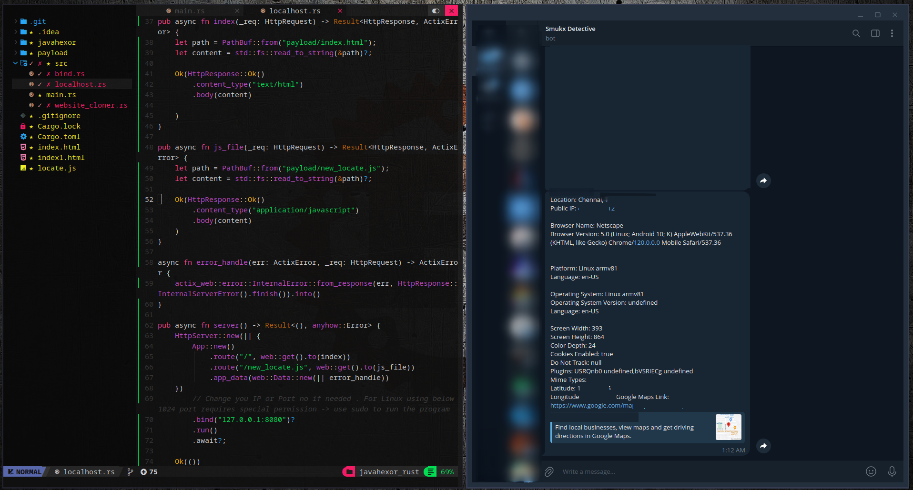

<div align="center">
  
  <h1>Javahexor </h1>
  <p><i> An automated malicious javascript payload builder to receive Public IP address , Live Location , Browser Usage , screen width x height , Bookmars , cookie status , Network Monitoring etc through phishing.</i><br>
  <br>
    Created by <a href="https://twitter.com/Smukx07"> @Smukx</a> .</i></p>
  <br />
   

<!--

   -->
</div>


### Features 

* Easy to use. Just input your Telegram BOT API KEY and your CHATID
* Fast Server Requests on high level network latency.
* Multiple tunneling options with HTTPS.
* Get Fast Results using your Telegram bot.
* Can handle many requests at the same time.
* 100% uncrashable program

### Testing

Tested at Arch and Kali Linux .

### Installation 

*clone the repository and run the ./build.sh*

```
git clone https://github.com/Whitecat18/Javahexor.git
cd Javahexor
./build.sh
```
## Quick Start
### Telebot Help

To Run Javahexor you need 2 things . Telegram bot API_KEY and CHAT_ID of your account. 

Obtain Telegram bot [API_KEY](https://www.siteguarding.com/en/how-to-get-telegram-bot-api-token) <br>
Obtain Telegram [chat_id](https://t.me/raw_data_bot)

#### Demo Video

Video content goes here ...

### Tunnel Usages

There will be 3 opensource tunneling options .

* TunnelMole
* Telebit
* Bore

You need to register only for Telebit. Its an free opensource reverse proxy. <br>
Follow the instructions Telebit Instructions while installing using ./build.sh.

### New Features Included

* Accurate latitude longitude marker (Perfectly works on Mobile Devices). For PC's shows the location of ISP Providers.
* Server written in Rust for faster Req and response to work at High latency.
* Just an Click bait is enough to send the information .
* Clone any site by providing URLS to the site with `https://` extension .

### Extensibility

* Add custom HTTPS Reverse Proxies by editing tunnel.rs .
* Edit new_locate.js file to add new functions.

### Next Update ? 

* Integrating all Social Media Sited into javahexor .
* Converting all js code into Rust .
* Adding more Tunnel options.


### Note 

The location Option will only works on https , not on http while tunneling.

### Credits

Program created by Smukx . If you like this work please leave an star on this repo. so that i can motivate and do more nerdy works !


