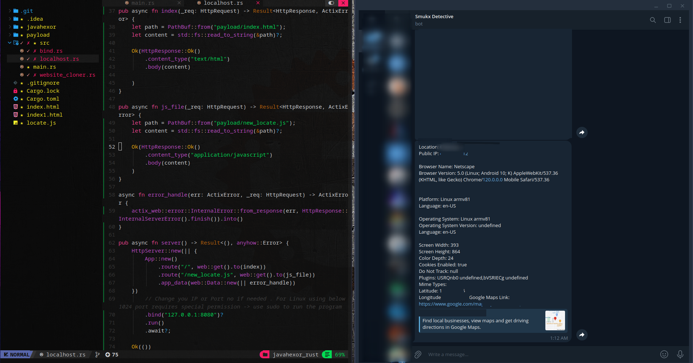

<div align="center">
  
  <h1>Javahexor </h1>
  <p><i> An automated malicious javascript payload builder to receive Public IP address , Live Location , Browser Usage , screen width x height , Bookmars , cookie status , Network Monitoring etc through phishing.</i><br>
  <br>
    Created by <a href="https://twitter.com/5mukx"> @Smukx</a> .</i></p>
   
   
</div>

### Features 

* Register your key only time . It saves automatically for future operations .
* Fast Server Requests on high level network latency.
* Bind Custom websites and tunnel with it . 
* Multiple tunneling options with HTTPS.
* Get Fast Results using your Telegram bot.
* Can handle many requests at the same time.

### Testing

Tested at Arch and Kali Linux .

### Installation 

*clone the repository and run the ./build.sh*

```
git clone https://github.com/Whitecat18/Javahexor.git
cd Javahexor
./build.sh
```

## Quick Start
### Telebot Help

To Run Javahexor you need 2 things . Telegram bot API_KEY and CHAT_ID of your account. 

Guide to obtain Telegram bot [API_KEY](https://www.siteguarding.com/en/how-to-get-telegram-bot-api-token) <br>
Guide to obtain Telegram [chat_id](https://t.me/raw_data_bot)

### How to use this Tool !

There are 4 options that you can use it

1. Bind custom website (Recommend)
    * Bind your custom website . Just Download or save the page into payload
      folder with the name ( index.html ).
    * Before using this option . Make sure to save your file to the /payload dir .
    * Remember . Save or rename your main html file into **index.html** .

2. Create a New Site from Scratch
    * This will Download an site Only(index.html) file and serve it !
    * You can use it to serve simple site such as example.com etc..

3. Start and serve HTTP Server 
    * If you want to reuse the payload without anychanges . you can use this method .
    * This will automatically will start and fetch the file to localhost .

4. Help
    * Displays Help 

5. Exit
    * Exit the Program in an safe way.

### Demo Video

<h4>Hexor 3.0 Demo [Custom Binding]</h4>

https://github.com/Whitecat18/Javahexor/assets/96696929/b28728d0-9e1e-4cac-94e5-8c0723908a57

<h4>Hexor 2.0 Demo</h4>

https://github.com/Whitecat18/Javahexor/assets/96696929/e1e1ab17-aeb3-42a5-aed4-f9a50b48e44e

### Tunnel Usages

There will be 3 opensource tunneling options .

* [Tunnel Mole](https://tunnelmole.com/)
* [Telebit](https://telebit.cloud/)
* [Bore](https://github.com/ekzhang/bore)
* [Tunnel Pyjam](https://tunnel.pyjam.as/) (manual)

You need to register only for Telebit. Its an free opensource reverse proxy. <br>

If you face any issues on Telebit Installations . Visit the site [Telebit](https://telebit.cloud/) and install it manually 

Follow the instructions while installing tunnels using ./build.sh.

The ,build.sh will automatically detect the distros and install the requirements and necessary pakages to run the program.
Note that we are installing 4 Opensource tunnels. if you find any error please mention it on the issues . 

### New Features Included

* Custom Binding on Websites . Save your site on /payload directory & build and bind with your site and start tunneling . 
* Accurate latitude longitude marker (Perfectly works on Mobile Devices). For PC's shows the location of ISP Providers.
* Server written in Rust for faster Req and response to work at High latency.
* Just an Click bait is enough to send the information .
* Clone any site by providing URLS to the site with `https://` or `http://` extension for 2nd Option . You can watch the Javahexor 2.0 Video to understand the module well !.

### Extensibility

* Add custom HTTPS Reverse Proxies by editing tunnel.rs .
* Edit new_locate.js file to add new functions.

### Next Update ? 

* Integrating all Social Media Sited into javahexor.
* Converting all js code into Rust.
* Adding some more opensource tunnels.


### Note 

*The location tracker will only works on https , not on http while tunneling. We are using an SOC Technique to gather exact location using geolocation. Remaining All the Tasks will be done by JSON API'S *

If you find any Errors while tunneling . Install the [Tunneling services](#tunnel-usages) manually.

### Credits

Program created by [@smukx](https://twitter.com/5mukx) . If you like this work please leave an star on this repo. so that i can motivate and do more nerdy works! 

If you want to look at my old javahexor that was actually written using python and js . Visit my Old [Branch](https://github.com/Whitecat18/Javahexor/tree/old_javahexor)


